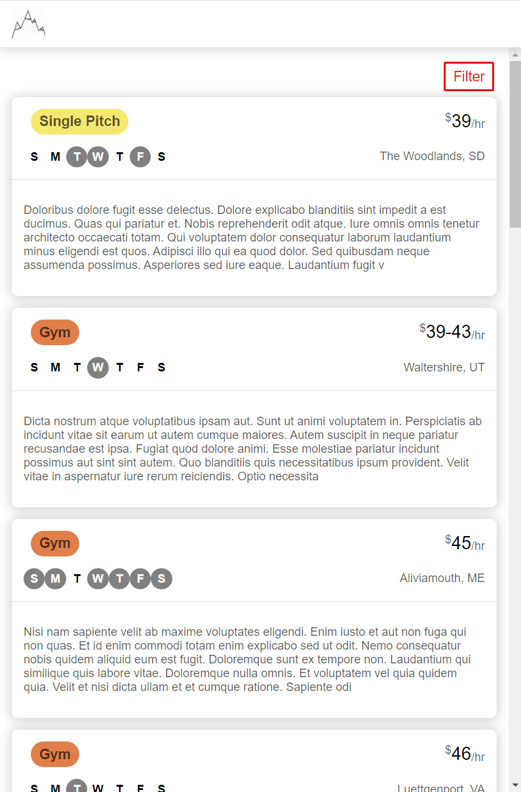

# Guide Demo
A responsive webpage for searching for climbing guides by climbing specialty and price

Deployed on Vercel and Heroku: https://guide-demo-jaymartmedia.vercel.app/

## Requirements
- Node.js v16.14.0 installed
- Yarn installed

## Running the API

You can run the api directly by changing into the `./api` directory and running:

```
yarn install
yarn start
```
The GraphiQL interface can be viewed at: http://localhost:4000/graphql

## Running the UI

You can run the UI by changing into the `./ui` directory and running:
```
yarn install
yarn build
yarn start
```
The UI can be viewed at: http://localhost:3000

Make sure to view both the desktop and mobile views!

## Screenshots
### Mobile View
Mobile list view



Mobile filter view


### Desktop View


